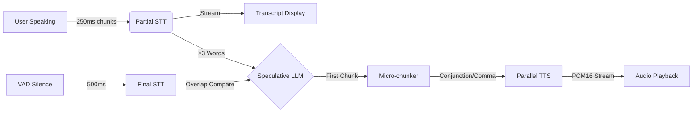

# 🎙️ GarsonAI - Ultra-Low Latency Voice Waiter System

**Production-grade voice AI for restaurant ordering in Turkish, optimized for sub-2s response latency.**

[](https://fastapi.tiangolo.com/)
[](https://reactjs.org/)
[](LICENSE)

---

## 🎯 Project Goals

GarsonAI is designed to solve the "latency problem" in voice-based conversational AI. By transforming a traditional sequential pipeline into a fully overlapping DAG with **speculative execution**, we've reduced first-audio-response latency from ~4.5 seconds to **~2.0 seconds**.

---

## 🧒 GarsonAI: 5-Yaşındaki Bir Çocuğun Anlayabileceği Şekilde (Basitçe)

Sıradan bir robotla konuştuğunuzda, robot önce sizin bitirmeniz bekler, sonra ne dediğinizi düşünür, sonra cevap verir. Bu çok yavaştır! 🐌

**GarsonAI ise bir "Hızlı Garson" gibidir:**

1.  **Siz konuşurken not alır:** Siz daha "Ben bir..." derken, o "Ben bir" yazdığını görür (STT).
2.  **Tahmin eder:** Siz "Ben bir hamburger..." dediğiniz anda, cümleyi bitirmenizi beklemeden mutfağa "Hamburger geliyor, hazırlanın!" diye bağırır (**Speculative LLM**).
3.  **Aynı anda çalışır:** Mutfak yemeği pişirirken (LLM), o çoktan masanıza gelip yanındaki içeceği doldurmaya başlar (**Parallel TTS**).

**Sonuç:** Siz cümlenizi bitirdiğinizde, o çoktan cevabını vermeye başlamış olur! ⚡

---

## 🚀 Key Features

- ⚡ **Speculative LLM Execution**: Starts LLM generation on partial transcripts while final STT completes.
- 🇹🇷 **Turkish Micro-chunking**: TTS triggers on Turkish conjunctions (`ve`, `ama`, `fakat`) and commas, not just sentence ends.
- 🎤 **Streaming Pipeline**: Fully overlapping STT chunks → LLM tokens → TTS PCM audio.
- 🌡️ **Container Warmers**: Periodic keep-alive pings eliminate cold-start penalties for STT and TTS.
- 🔊 **Parallel TTS Workers**: Orchestrates multiple TTS streams to handle long responses without stuttering.
- 📱 **QR-Based Access**: Scan a table's QR to open the menu and start talking immediately.

---

## 🏗️ Architecture & Pipeline

### The Optimized Voice DAG

Traditional voice systems wait for each stage to finish. GarsonAI overlaps every stage to hide latency.



### Speculative Execution Logic
1.  **Trigger**: The moment a partial transcript reaches 3 words, the LLM is fired in the background.
2.  **Parallel STT**: While LLM is generating, the backend performs the "Final STT" on the full audio buffer.
3.  **Conflict Resolution**:
    - If partial and final transcripts have **≥70% word overlap**, the speculative result continues (saving ~600ms).
    - If they diverge, the speculative task is cancelled and the LLM restarts with the corrected text.

### Turkish Micro-chunking
To trigger TTS earlier, we don't wait for a full sentence (`. ! ?`). We trigger when we see:
- A comma (after at least 3 words).
- A Turkish conjunction (`ve`, `ama`, `fakat`, `çünkü`, `fakat`, `ancak`, `veya`, `ya da`).
- Any sentence-ending punctuation.

---

## ⚡ Latency Breakdown

| Stage | Optimization | Latency Impact |
|-------|--------------|----------------|
| **VAD** | Reduced threshold to 500ms | **-300ms** |
| **Delivery** | 250ms binary WebSocket chunks | **-250ms** |
| **STT** | Trigger after only 500ms of audio | **-1000ms** |
| **Pipeline** | Speculative LLM Start | **-600ms** |
| **TTS** | Turkish Micro-chunking | **-200ms** |
| **Infrastructure** | Container Keep-alive (Warmers) | **-2000ms (Cold start)** |

**Current Average Latency: ~2.0s** 🚀

---

## 🛠️ Tech Stack

### Frontend
- **React 19** + **Vite**
- **TailwindCSS 4** + **DaisyUI 5**
- **Web Audio API**: Real-time PCM16 streaming playback.
- **VAD**: RMS-based amplitude analysis in the browser.

### Backend
- **FastAPI**: Async Python framework.
- **uvloop**: 2-4x faster asyncio event loop.
- **SQLAlchemy**: PostgreSQL ORM.
- **fal.ai**: Freya STT (Whisper-optimized) & Freya TTS (Turkish "Zeynep" voice).
- **OpenRouter**: Google Gemini 2.5 Flash for ultra-fast reasoning.

---

## 🚀 Installation & Running

### 1. Prerequisites
- Python 3.10+
- Node.js 18+
- PostgreSQL
- API Keys: `FAL_KEY`, `OPENROUTER_API_KEY`

### 2. Setup
```bash
chmod +x setup.sh
./setup.sh
```

### 3. Run (Optimized Mode)
```bash
chmod +x start-optimized.sh
./start-optimized.sh
```

#### 5. Deployment with Docker (Production Ready)

For a real-world deployment, use the provided Docker configuration:

```bash
# 1. Prepare environment
cp .env.example .env
# Edit .env with your production API keys and URLs
# Example:
# VITE_API_URL=https://api.yourdomain.com
# VITE_WS_URL=wss://api.yourdomain.com

# 2. Start the entire stack
docker-compose up -d --build
```

The stack includes:
- **Frontend**: Nginx serving the React build on port 80.
- **Backend**: Gunicorn + Uvicorn workers on port 8000.
- **Database**: PostgreSQL 15 on port 5432.

---

## ⚙️ Configuration

---

## 📚 API Endpoints

### Voice WebSocket
- **URL**: `ws://localhost:8000/ws/voice/{table_qr_token}`
- **Protocol**: Binary (for audio) + JSON (for control).
- **Messages**:
    - `audio_chunk` (Binary): 250ms Opus frames.
    - `audio_end` (JSON): Signals user finish (often redundant with VAD).
    - `transcript` (JSON): Real-time partial and final text.
    - `ai_token` (JSON): Streaming text from LLM.
    - `audio_data` (Binary): Streaming PCM16 audio for playback.

### Management API (REST)
- `POST /api/auth/register`
- `POST /api/auth/login`
- `GET /api/restaurant/tables` — QR management.
- `GET /api/restaurant/orders` — Real-time kitchen dashboard.
- `POST /api/restaurant/tables/{id}/pay-all` — Bulk payment settlement.

---

## 🛡️ Production Resilience
- **Auto-Retry**: STT service retries on 500 errors with backoff.
- **Connection Pooling**: Reuses HTTP connections to fal.ai.
- **Concurrency Control**: Semaphores limit concurrent AI requests to prevent rate limiting.
- **Cleanup**: Async tasks are properly cancelled on client disconnect to free up resources.
